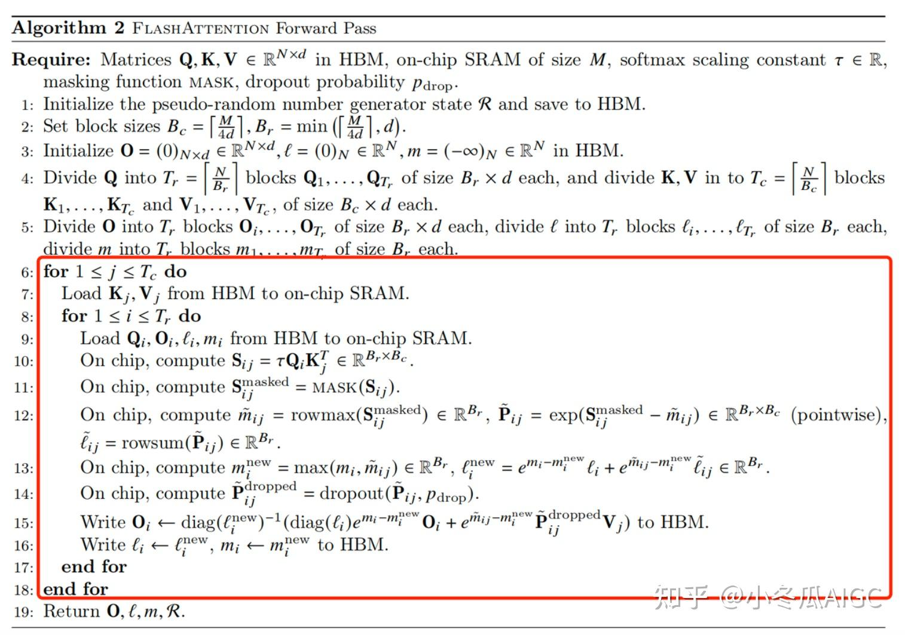
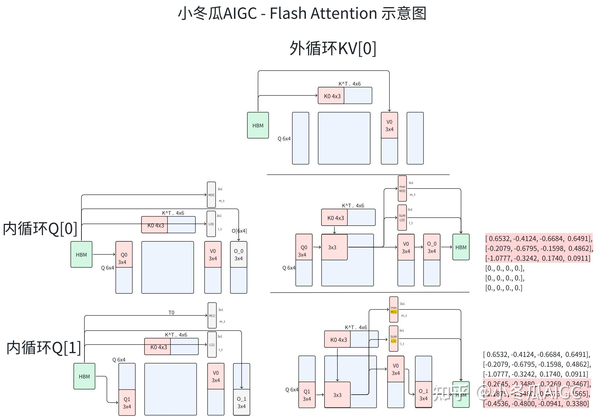
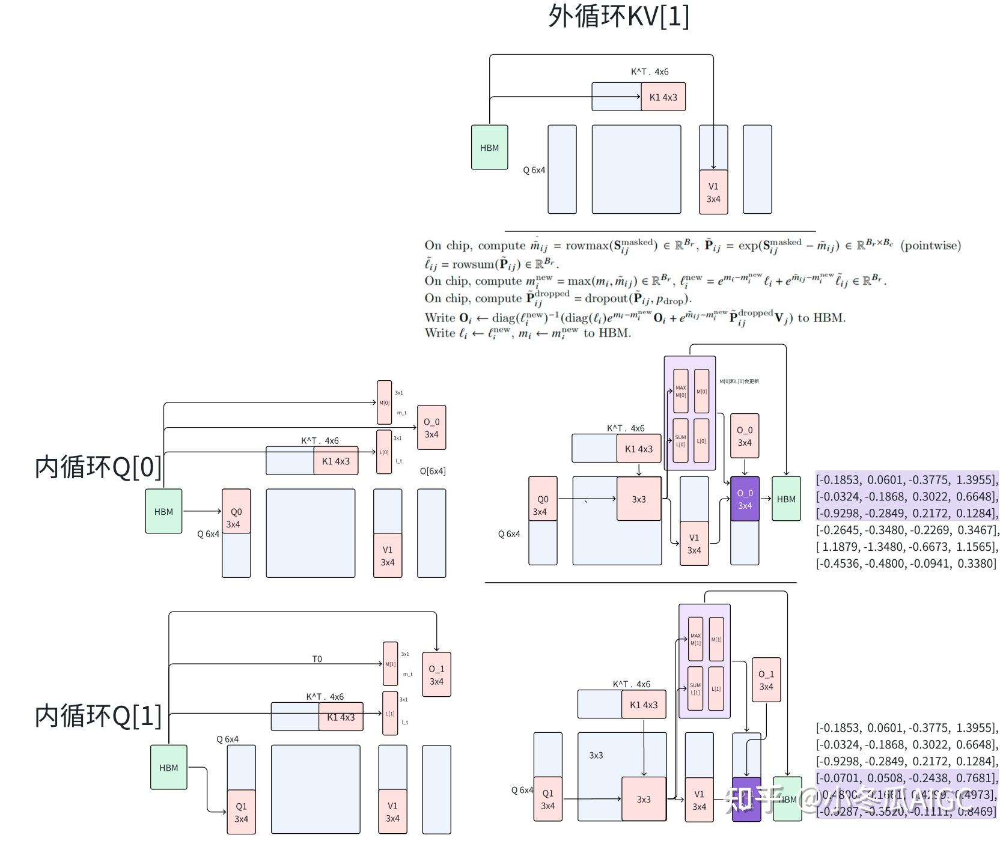

### 2.1 softmax
$$\tilde{x}_i = \frac{e^{x_i}}{\sum_{j}^{N} e^{x_j}}$$

### 2.2 safe softmax
$$\tilde{x}_i = \frac{e^{x_i - \max(x_{:N})}}{\sum_{j}^{N} e^{x_j - \max(x_{:N})}}$$

防止最大值导致数值上溢。证明 safe softmax 与 softmax 的等价性
			$$
			\begin{aligned}
			\tilde{x}_i &= \frac{e^{x_i - \max(x_{:N})}}{\sum_{j}^{N} e^{x_j - \max(x_{:N})}} \\
			&= \frac{e^{x_i - M}}{\sum_{j}^{N} e^{x_j - M}} \\
			&= \frac{e^{x_i} / e^{M}}{\sum_{j}^{N} e^{x_j} / e^{M}} \\
			&= \frac{e^{x_i}}{\sum_{j}^{N} e^{x_j}}
			\end{aligned}
			$$

### 2.3 online softmax

1. 首先计算 $1:N$ 元素的最大值 $\max(x_{:N})$ 和分母（指数和 $\sum(\exp(x))$）$l_N$  
	   $$
	   l_N = \sum_{j}^{N} e^{x_j - \max(x_{:N})}
	   $$

2. 新加入 1 个元素 $x_{N+1}$，根据以下推导更新 $\max(x_{:N+1})$ 和 $l_{N+1}$  
	   $$
	   \begin{aligned}
	   \max(x_{:N+1}) &= \max(\max(x_{:N}), x_{N+1}) \\
	   l_{N+1} &= \sum_{j}^{N+1} e^{x_j - \max(x_{:N+1})} \\
	   &= \left( \sum_{j}^{N} e^{x_j - \max(x_{:N+1})} \right) + e^{x_{N+1} - \max(x_{:N+1})} \\
	   &= \left( \sum_{j}^{N} e^{x_j - \max(x_{:N})} e^{\max(x_{:N}) - \max(x_{:N+1})} \right) + e^{x_{N+1} - \max(x_{:N+1})} \\
	   &= \left( \sum_{j}^{N} e^{x_j - \max(x_{:N})} \right) \left( e^{\max(x_{:N}) - \max(x_{:N+1})} \right) + e^{x_{N+1} - \max(x_{:N+1})} \\
	   &= l_N \left( e^{\max(x_{:N}) - \max(x_{:N+1})} \right) + e^{x_{N+1} - \max(x_{:N+1})}
	   \end{aligned}
	   $$

3. 根据全局的最大值和分母计算 softmax  
	   $$
	   \tilde{x}_i = \frac{e^{x_i - \max(x_{:N+1})}}{l_{N+1}}
	   $$

### 2.4 block online softmax

online softmax 随着新加入的元素可以更新分母 $l$，实际上我们不会频繁逐个加入进行更新分母，而是以块形式计算各自的分母最大值，再按照 online-softmax 原理来更新。各自块独立计算分母好处是可以并行计算

1. 我们独立计算各块的分母 $l^{(t)}$ 和 $m^{(t)}$，
   $$
   \begin{aligned}
   l^{(1)} &= l_N = \sum_{j=1}^{N} e^{x_j - \max(x_{:N})} \\
   m^{(1)} &= \max(x_{:N}) \\
   l^{(2)} &= l_{N:2N} = \sum_{j=N+1}^{2N} e^{x_j - \max(x_{N+1:2N})} \\
   m^{(2)} &= \max(x_{N+1:2N})
   \end{aligned}
   $$
   注意：这里的 $l^{(1)}$ 和 $l^{(2)}$ 所减的最大值是不同的

2. 然后我们全局更新最大值 $m$
   $$
   \begin{aligned}
   m &= \max(x_{:2N}) = \max\left(\max(x_{:N}), \max(x_{N+1:2N})\right) \\
   &= \max\left(m^{(1)}, m^{(2)}\right)
   \end{aligned}
   $$
   但是 $l$ 并不能累加更新，因为不同的 $l$ 不能保证减去了全局最大值。
   $$
   l = l_{2N} \neq l^{(1)} + l^{(2)}
   $$

3. 我们按照以下推导更新全局 $l$
   $$
   \begin{aligned}
   l^{(1)} &= \sum_{j=1}^{N} e^{x_j - \max(x_{:N})} = \sum_{j=1}^{N} e^{x_j - m^{(1)}} \\
   l^{(2)} &= \sum_{j=N+1}^{2N} e^{x_j - \max(x_{N+1:2N})} = \sum_{j=N+1}^{2N} e^{x_j - m^{(2)}} \\
   l &= \sum_{j=1}^{2N} e^{x_j - \max(x_{:2N})} \\
   &= \left( \sum_{j=1}^{N} e^{x_j - \max(x_{:2N})} \right) + \left( \sum_{j=N+1}^{2N} e^{x_j - \max(x_{:2N})} \right) \\
   &= \left( \sum_{j=1}^{N} e^{x_j - m} \right) + \left( \sum_{j=N+1}^{2N} e^{x_j - m} \right) \\
   &= \left( \sum_{j=1}^{N} e^{x_j - m^{(1)}} \right) \left( e^{m^{(1)} - m} \right) + \left( \sum_{j=N+1}^{2N} e^{x_j - m^{(2)}} \right) \left( e^{m^{(2)} - m} \right) \\
   &= l^{(1)} \left( e^{m^{(1)} - m} \right) + l^{(2)} \left( e^{m^{(2)} - m} \right)
   \end{aligned}
   $$

4. 最终 online-softmax
   $$
   \tilde{x}_i = \frac{e^{x_i - m}}{l}
   $$
### 2.5 **Flash-attention**
	在了解flash-attention之前存在的一些好奇心
		flash-attention相较于传统的attention的优势在哪里？
		flash-attention的流程，包括公式推导和硬件交互
		flash-attention的实现以及传统的实现

- flash-attention的流程，包括公式推导和硬件交互
	- 2-pass online self- attention（基于online softmax）
		$$
		\begin{aligned}
		&\text{for } i \to 1, N \\
		&\quad x_i \leftarrow Q[k, :] K^T[:, i] \\
		&\quad m_i \leftarrow \max(m_{i-1}, x_i) \\
		&\quad d'_i \leftarrow d'_{i-1} e^{m_{i-1}-m_i} + e^{x_i - m_i} \\
		&\text{for } i \to 1, N \\
		&\quad a_i \leftarrow \frac{e^{x_i - m_N}}{d'_N} \\
		&\quad o_i \leftarrow o_{i-1} + a_i V[i, :]
		\end{aligned}
		$$

	- 首先将系数 $d$ 改成迭代形式

		$$
		\begin{aligned}
		o_i &\leftarrow o_{i-1} + \frac{e^{x_i - m_N}}{d'_N} V[i, :] \\
		o_i &:= \sum_{j=1}^{i} \left( \frac{e^{x_j - m_N}}{d'_N} V[j, :] \right) \\
		o'_i &= \left( \sum_{j=1}^{i} \frac{e^{x_j - m_i}}{d'_i} V[j, :] \right)
		\end{aligned}
		$$

	其中，前 $i$ 个元素的局部指数和 $d'_i$ 和局部最大值 $m_i$，所计算出的 $o'_i$ 为局部注意力输出。当 $i = N$ 时，$o_i = o'_i$。将 $o_i$ 改写成迭代形式：

		$$
		\begin{aligned}
		o'_i &= \sum_{j=1}^{i} \frac{e^{x_j - m_i}}{d'_i} V[j, :] \\
		&= \left( \sum_{j=1}^{i-1} \frac{e^{x_j - m_i}}{d'_i} V[j, :] \right) + \frac{e^{x_i - m_i}}{d'_i} V[i, :] \\
		&= \left( \sum_{j=1}^{i-1} \frac{e^{x_j - m_{i-1}}}{d'_{i-1}} \frac{e^{x_j - m_i}}{e^{x_j - m_{i-1}}} \frac{d'_{i-1}}{d'_i} V[j, :] \right) + \frac{e^{x_i - m_i}}{d'_i} V[i, :] \\
		&= \left( \sum_{j=1}^{i-1} \frac{e^{x_j - m_{i-1}}}{d'_{i-1}} V[j, :] \right) \frac{e^{x_j - m_i}}{e^{x_j - m_{i-1}}} \frac{d'_{i-1}}{d'_i} + \frac{e^{x_i - m_i}}{d'_i} V[i, :] \\
		&= \left( \sum_{j=1}^{i-1} \frac{e^{x_j - m_{i-1}}}{d'_{i-1}} V[j, :] \right) e^{m_{i-1} - m_i} \frac{d'_{i-1}}{d'_i} + \frac{e^{x_i - m_i}}{d'_i} V[i, :] \\
		&= o'_{i-1} \frac{d'_{i-1} e^{m_{i-1} - m_i}}{d'_i} + \frac{e^{x_i - m_i}}{d'_i} V[i, :] \\
		&= o'_{i-1} \frac{d'_{i-1} e^{m_{i-1} - m_i}}{d'_i} + e^{m_j - m_i} \frac{e^{x_i - m_j}}{d'_i} V[i, :]
		\end{aligned}
		$$
		整体流程如下（省略外循环）：
		
$$
\begin{aligned}
&\textbf{for } i = 1 \textbf{ to } N \textbf{ do} \\
&\quad x_i \;\leftarrow\; Q[k, :] \, K^\top[:,\, (i-1)b : ib] \\[4pt]
&\quad m'_i \;\leftarrow\; \max_{1 \leq j \leq b} \bigl( x_i[j] \bigr) \\[4pt]
&\quad m_i \;\leftarrow\; \max \bigl( m_{i-1},\, m'_i \bigr) \\[4pt]
&\quad d'_i \;\leftarrow\; d'_{i-1} \, e^{\,m_{i-1} - m_i} \;+\; \sum_{j=1}^{b} e^{\,x_i[j] - m_i} \\[4pt]
&\quad o'_i \;\leftarrow\; o'_{i-1} \cdot \frac{d'_{i-1} \, e^{\,m_{i-1} - m_i}}{d'_i}
\;+\; \sum_{j=1}^{b} \frac{e^{\,x_i[j] - m_i}}{d'_i} \, V\bigl[\,j + (i-1)b,\, :\bigr] \\[4pt]
&\textbf{end for} \\[6pt]
&O[k, :] \;\leftarrow\; o'_N
\end{aligned}
$$

	
根据上述算法图，具体流程为：
	
	
- flash-attention的实现以及传统的实现
		见python代码
- flash-attention相较于传统的attention的优势在哪里
	- 显存开销变小，不仅是forward而且也有backward
		设：B：batch size；H：attention heads；N：sequence length and d：head dimension  
		普通 Self-Attention 的显存开销
			标准计算形式：$\text{Attention}(Q,K,V) = \mathrm{Softmax}(QK^T)V$必须存储的中间量$Q, K, V ∈ ℝ^{B×H×N×d}$
			- Attention scores  
			  $$
			  S = QK^T ∈ ℝ^{B×H×N×N}
			  $$
			- Softmax 概率  
			  $$
			  P = \mathrm{Softmax}(S) ∈ ℝ^{B×H×N×N}
			  $$
			因此显存复杂度
				- Q, K, V：O(B·H·N·d)
				- S, P：O(B·H·N²)
			**总显存复杂度：**
			$$
			\boxed{O(B·H·N^2)}
			$$
			**注意**：反向传播需要保留 `S` 和 `P`，无法释放。
		FlashAttention 的显存开销
			FlashAttention 不显式构造完整的 attention matrix，而是采用block-wise + online softmax。
			核心思想：
				- 按 block 计算 $Q_i K_j^T$，仅生成小块 $b×b$
				- 使用 running max  $m$  和 running sum `l` 在线累计 softmax
				- 不存储 $N×N$ 的 attention matrix
			需要存储的张量
				- $Q, K, V ∈ ℝ^{B×H×N×d}$
				- Output $O ∈ ℝ^{B×H×N×d}$
				- Running statistics  $m, l ∈ ℝ^{B×H×N×1}$
			显存复杂度
				- 所有张量均为 $O(B·H·N·d)$ 或 $O(B·H·N)$
			**总显存复杂度：**
			$$
			\boxed{O(B·H·N·d)}
			$$
	- 计算主要发生在 **SRAM / registers**， 显存带宽需求显著降低
### 2.6 **Flash-Attention2**
相对于flash-attention1，flash-attention2在三个方面进行改进，分别是
1. 优化非乘法计算
2. 优化QKV for 循环顺序
3. 采用`shared memory`减少通信
	改进QKV for循环顺序
		`Flash Attention 1` 最大的问题在于`O[i]`需要频繁的读写`SRAM` 缓存。
		`Flash Attention 2` 将`Q`当作外循环，`KV`当作内循环， 将`O[i]`的在一个`Q[i]`周期算完, `O[i]{t}<-O[i]{t-1}` 。
		从`O`的缓存`write/read`次数从$2 * B_q * B_kv$-> $2 * B_q$`次
	优化非乘法计算
		**Flash Attention** 每次都要做 **Scaled**（对 $O * L_i^{-1}$），都是额外的非乘法计算。在 Flash Attention 中，计算 $O$ 时存在非乘法（non-matmul）的计算，非常耗时，如$\text{diag}(l^{(2)})^{-1}$：
		$$
		O^{(2)} = \text{diag}(l^{(1)}/l^{(2)})^{-1} O^{(1)} + \text{diag}(l^{(2)})^{-1} e^{S^{(2)} - m^{(2)}} V^{(2)}
		$$
		提取出 $\text{diag}(l^{(2)})^{-1}$ 系数，计算 $O$ 的过程 **un-scaled**，对 $O$ 最后时刻做 **scaled**：
		$$
		\begin{aligned}
		\tilde{O}^{(2)} &= \text{diag}(l^{(1)})^{-1} O^{(1)} + e^{S^{(2)} - m^{(2)}} V^{(2)} \\
		O^{(2)} &= \text{diag}(l^{(2)})^{-1} \tilde{O}^{(2)} \\
		O^{(N)} &= \text{diag}(l^{(N)})^{-1} \tilde{O}^{(N)}
		\end{aligned}
		$$
代码，见python文件

全文参考
[小冬瓜笔记-flash-attention前情概要](https://zhuanlan.zhihu.com/p/5078640012)
[小冬瓜笔记-flash-attention](https://zhuanlan.zhihu.com/p/663932651)
